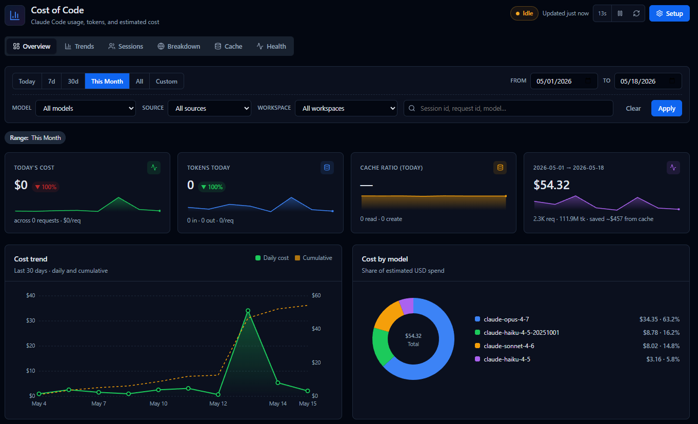
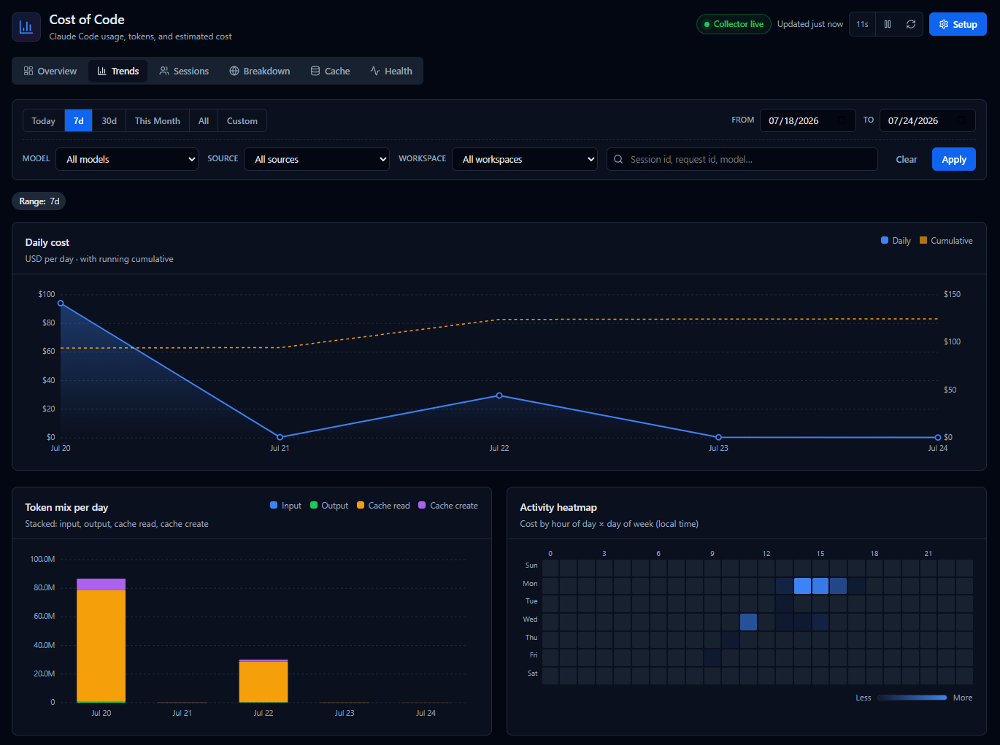
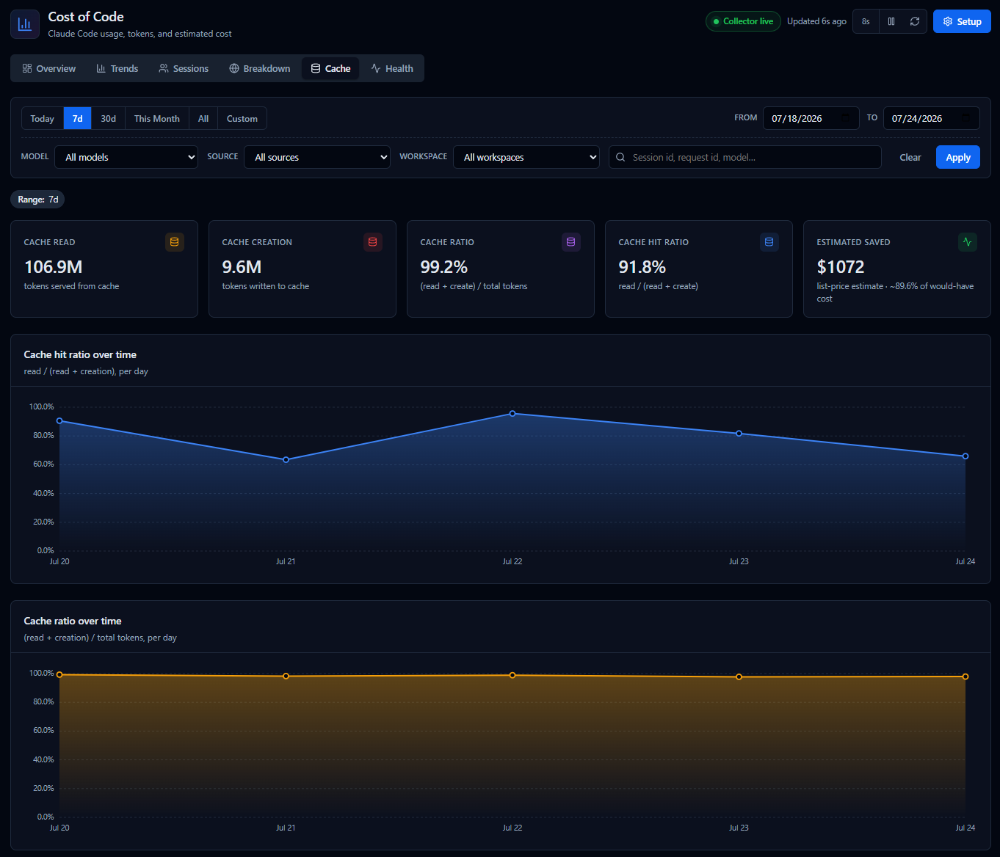

# Cost of Code

Cost of Code is a local-first dashboard for Claude Code usage, tokens, and
estimated cost. It receives Claude Code OpenTelemetry events on `localhost`,
writes them to JSONL under `~/.claude/usage-tracker/`, and renders a VSCode
dashboard with tabs for Overview, Trends, Sessions, Breakdown, Cache, and
Health.

No cloud, no account, no remote server. Privacy-safe by default.

---

## Dashboard

*Screenshots are cropped below the fold to hide personal project details —
install the extension to see the full picture.*

**Overview** — today's cost, tokens, cache ratio, and the current period's
cost trend and per-model split.



**Trends** — daily cost over the selected range, token mix per day, and an
activity heatmap by hour/day of week.



**Cache** — cache read/creation volume, hit ratio, and estimated savings from
prompt caching.



Every view supports filtering by date range, model, source, and workspace.

**Explorer view** — a collapsible **Cost of Code** section sits in the Explorer
next to Timeline and Outline: today's cost with a change-vs-yesterday delta and
a trend line of today's spend hour by hour, the Claude-vs-Codex share bar, a
donut of today's cost by model, the cache hit ratio, and the collector state. Everything has a
hover tooltip, and one button opens the full dashboard. Drag it to the Secondary Side
Bar to keep it visible while you work.

---

## Commands

| Command                                                          | What it does                                                                                           |
| ----------------------------------------------------------------- | -------------------------------------------------------------------------------------------------------- |
| `Cost of Code: Open Dashboard`                                   | Opens the dashboard webview.                                                                            |
| `Cost of Code: Refresh Explorer View`                            | Re-reads usage data for the compact Explorer view (also on the view's title bar).                       |
| `Cost of Code: Run Setup (install collector + autostart)`        | Installs the collector and registers autostart. The setup dialog lets you pick a port and **Check** whether it's free before installing. |
| `Cost of Code: Start Collector`                                  | Starts the collector if it isn't already running.                                                       |
| `Cost of Code: Stop Collector`                                   | Stops the running collector.                                                                             |
| `Cost of Code: Show Collector Status`                            | Shows autostart state, the HTTP endpoint and port, the status file, and telemetry env — use this to confirm the collector is reachable. |
| `Cost of Code: Uninstall Collector`                              | Stops the collector and removes the autostart entry. Usage data is preserved.                           |
| `Cost of Code: Import Historical Usage (from ~/.claude/projects)` | Backfills usage from past Claude Code transcripts. Supports a dry-run preview; dates already covered by OTEL are skipped, so re-running is safe. |

All of these are also available as buttons on the dashboard's **Health** tab.

---

## Components

```
cost-of-code/
├── collector/                 # Node.js OTLP/HTTP receiver (zero deps)
│   ├── collector.js           #   Receives /v1/logs, /v1/metrics, /v1/traces
│   └── normalizer.js          #   Parses Claude Code log events to usage records
├── scripts/                   # Platform install / uninstall / status helpers
│   ├── install.ps1            #   Windows Scheduled Task + Claude settings
│   ├── install.sh             #   Linux systemd/cron or macOS launchd LaunchAgent
│   ├── uninstall.*            #   Remove autostart + telemetry settings
│   └── status.*               #   Collector diagnostics
└── src/                       # VSCode extension
    ├── extension.ts           # Command registration
    ├── DashboardPanel.ts      # Webview with 6 tabs
    ├── SidebarView.ts         # Compact Explorer webview view
    ├── usageReader.ts         # Reads / aggregates JSONL
    ├── healthCheck.ts         # Health probe (HTTP + status file + task)
    ├── exportService.ts       # JSONL/CSV export
    ├── installer.ts           # Bridges commands to PowerShell scripts
    └── ...
```

---

## Development Setup

Prerequisite: Node.js 20+ and npm.

### Windows

1. Run the new joiner setup script:

   ```bat
   setup.bat
   ```

   It installs npm dependencies and compiles the extension once.

2. Load the extension in VSCode:

   Press F5 inside VSCode to launch the Extension Development Host.

3. From the new VSCode window, run **`Cost of Code: Open Dashboard`**
   (or `Cost of Code: Run Setup`).

### macOS / Linux

```sh
npm ci
npm run compile
```

Then open the folder in VS Code and press `F5` to launch the Extension
Development Host.

## Collector Setup

From the Extension Development Host, run **`Cost of Code: Run Setup`**.

Setup runs hidden in the background and reports completion via a notification.
It will:

- Copy `collector.js`, `normalizer.js`, and `record-session.js` to
  `~/.claude/usage-tracker/bin`.
- Register autostart:
  - Windows: Scheduled Task **`ClaudeCodeUsageTracker`** at logon.
  - Linux: systemd user service **`claude-usage-tracker`**, with cron fallback.
  - macOS: launchd LaunchAgent **`com.claude.usage-tracker`** in
    `~/Library/LaunchAgents`, loaded at login.
- **Merge** Claude Code's OpenTelemetry settings into `~/.claude/settings.json`
  (under the `env` block). Other keys in the file are left untouched:
  ```jsonc
  {
    "env": {
      "CLAUDE_CODE_ENABLE_TELEMETRY": "1",
      "OTEL_LOGS_EXPORTER":           "otlp",
      "OTEL_METRICS_EXPORTER":        "otlp",
      "OTEL_TRACES_EXPORTER":         "otlp",
      "OTEL_EXPORTER_OTLP_PROTOCOL":  "http/json",
      "OTEL_EXPORTER_OTLP_ENDPOINT":  "http://127.0.0.1:4318",
      "OTEL_METRIC_EXPORT_INTERVAL":  "10000",
      "OTEL_LOGS_EXPORT_INTERVAL":    "5000"
    }
  }
  ```
- Start the collector immediately.

Run Claude Code as usual (CLI or in VSCode). Claude Code reads
`~/.claude/settings.json` at startup and exports telemetry to the local
collector. If a Claude Code session was already running, restart that session.

You can also run the setup scripts directly:

```powershell
powershell -NoProfile -ExecutionPolicy Bypass -File scripts\install.ps1
```

```sh
scripts/install.sh
```

To uninstall (data preserved by default):

```powershell
powershell -NoProfile -ExecutionPolicy Bypass -File scripts\uninstall.ps1
# or, to also delete ~/.claude/usage-tracker:
powershell -NoProfile -ExecutionPolicy Bypass -File scripts\uninstall.ps1 -PurgeData
```

```sh
scripts/uninstall.sh
# or, to also delete ~/.claude/usage-tracker:
scripts/uninstall.sh --purge-data
```

---

## Data layout

```
~/.claude/usage-tracker/
├── bin/                                  # collector.js + normalizer.js + record-session.js
├── raw/YYYY-MM-DD.otel.jsonl             # raw OTLP payloads (one per line)
├── usage/YYYY-MM-DD.usage.jsonl          # normalized usage records (dedup'd)
├── logs/YYYY-MM-DD.collector.log         # collector log
├── exports/<timestamp>_<label>.{jsonl,csv}
├── config/                               # reserved for future user-editable config
├── session-meta.jsonl                    # session_id -> workspace (from SessionStart hook)
└── status.json                           # heartbeat (refreshed every ~15s)
```

### Workspace attribution

Claude Code's OpenTelemetry payloads do **not** include the working directory,
so by themselves we cannot tell which repo each request came from. Setup
registers a Claude Code **`SessionStart` hook** that writes
`{ session_id, workspace, started_at }` to `session-meta.jsonl` whenever a
new session begins. The dashboard joins each `api_request` record back to its
workspace via `session_id` at read time. Sessions that started before the
hook was installed appear as `<unknown>`.

Privacy: prompt content, tool results, and file contents are **not** captured.
The normalizer only keeps token counts, model id, request/session ids,
estimated cost, and timing.

---

## Token totals

The dashboard shows two totals (per requirement §7):

| Metric                          | Formula                                                          |
| ------------------------------- | ---------------------------------------------------------------- |
| Total tokens **without cache**  | `input + output`                                                 |
| Total tokens **with cache**     | `input + output + cache_read + cache_creation`                   |

Cost is shown as **estimated cost** — it is sourced from `cost_usd` emitted by
Claude Code itself and is **not** authoritative billing.

---

## Extension settings

| Setting                                    | Default | Purpose                                       |
| ------------------------------------------ | ------- | --------------------------------------------- |
| `claudeUsageTracker.dataFolder`            | `""`    | Override `~/.claude/usage-tracker`             |
| `claudeUsageTracker.collectorPort`         | `4318`  | Port the local collector listens on           |
| `claudeUsageTracker.autoRefreshSeconds`    | `15`    | Re-read interval for the dashboard **and** the Explorer view. 0 disables auto-refresh |
| `claudeUsageTracker.pricing`               | `{}`    | Per-model pricing overrides per 1M tokens     |

---

## Development Commands

```sh
npm run compile
npm run lint
npm run check
npm run package
```

The Windows `build.bat` wrapper runs `npm ci`, `npm run check`, and then
packages the extension with the pinned local `vsce` dependency.

---

## Diagnostics

If the dashboard shows zero usage:

1. Open the **Health** tab.
2. Check **Collector responding (HTTP)** — if no, click **Start collector**.
3. Check **Telemetry env configured** — if no, run setup again or open a new
   VSCode window so it inherits the user-scope env vars.
4. Click **Show status** to see the scheduled-task state, the heartbeat file,
   and the live `/status` HTTP response side by side.

---

## Notes & limitations

- **OTLP/JSON only** (no protobuf). Setup explicitly sets
  `OTEL_EXPORTER_OTLP_PROTOCOL=http/json` for that reason. If Claude Code
  cannot be configured to use `http/json`, this collector will not receive its
  exports.
- **Windows, Linux, and macOS setup are supported.** Windows uses Scheduled
  Tasks. Linux uses a systemd user service when available, with cron as a
  fallback. macOS uses a launchd LaunchAgent (`com.claude.usage-tracker`).
- **Single user.** Data lives under the current user's `~/.claude/usage-tracker`.

## License

MIT
